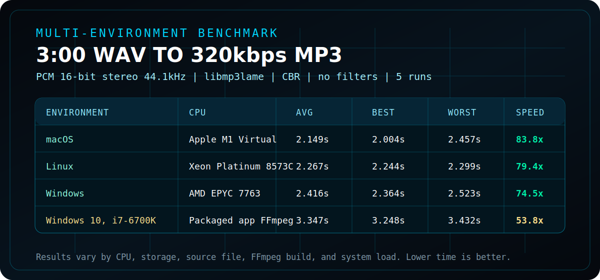

# 320 MP3 Fast Encoder v1.0

**High-performance standalone MP3 transcoder by OG Plugins.**

[Official Website / Download](https://stuckedf-glitch.github.io/320Mp3FastEncoder/)

[English](#english) | [Portugues](#portugues)

## Benchmark Results

Test file: 3:00 WAV PCM 16-bit stereo 44.1kHz converted to MP3 320kbps CBR with libmp3lame and no filters. Each result uses 5 runs. Lower time is better. Results vary by CPU, storage, source file, FFmpeg build, and system load.

## Freeware License

320 MP3 Fast Encoder is distributed under a free-to-use freeware license.

- Free to download and use.
- Free for personal, non-commercial use.
- Paid, commercial, or professional use requires prior written authorization from OG Plugins.
- No subscription, activation, ads, or hidden usage limits.
- Files generated with the software belong to the user.
- OG Plugins keeps the copyright, brand, installer, and official binaries.
- Do not sell, repackage, or redistribute modified installers without permission from OG Plugins.

## English

### Overview

320 MP3 Fast Encoder is a fast, lightweight standalone utility designed to convert audio files into high-quality 320kbps MP3 files. It focuses on speed, simple operation, batch workflow, and a cyberpunk-inspired interface.

### Main Features

- Drag and drop audio files directly into the app.
- Convert multiple files in a batch queue.
- Output fixed 320kbps CBR MP3 files.
- Uses FFmpeg / LAME for reliable transcoding.
- Runs conversion in the background so the interface stays responsive.
- Includes an ID3v1 multi-editor for batch metadata.
- Preserves a fast, simple workflow with no account or subscription.

### Supported Input Formats

WAV, AIFF, AIF, MP3, FLAC, ALAC, M4A, AAC, OGG, WMA, MPEG, MPG.

### Output

- Format: MP3
- Bitrate: 320kbps CBR
- Tags: ID3v1 metadata
- Destination: the same folder as the original file

### ID3v1 Multi-Editor

The metadata editor can set Title, Artist, Album, Track, Year, Genre, BPM, Encoded by, and Comment. When applied, all tracks currently in the window are edited according to the fields entered by the user.

### Platforms

- Windows 10/11 (64-bit)
- macOS 10.15 Catalina or later

### Privacy And Installer Notice

The installer includes EULA and Privacy Notice screens. Standard installation and uninstallation telemetry may be collected as described in those documents.

## Downloads

- Windows Installer: [320FastEncodeR_Setup_1.0_Windows.exe](downloads/320FastEncodeR_Setup_1.0_Windows.exe)
- macOS Installer: [320FastEncodeR_Installer_1.0_Mac.dmg](downloads/320FastEncodeR_Installer_1.0_Mac.dmg)

## Portugues

### Visao Geral

320 MP3 Fast Encoder e um utilitario standalone rapido e leve, criado para converter arquivos de audio em MP3 de alta qualidade a 320kbps. O foco e velocidade, operacao simples, processamento em lote e uma interface inspirada no estilo cyberpunk.

### Principais Funcoes

- Arraste e solte arquivos de audio diretamente no app.
- Converta varios arquivos em fila/lote.
- Gere MP3 fixo em 320kbps CBR.
- Usa FFmpeg / LAME para transcodificacao confiavel.
- A conversao roda em segundo plano para nao travar a interface.
- Inclui multi-editor ID3v1 para metadados em lote.
- Fluxo rapido e simples, sem conta, assinatura ou ativacao.

### Formatos De Entrada Suportados

WAV, AIFF, AIF, MP3, FLAC, ALAC, M4A, AAC, OGG, WMA, MPEG, MPG.

### Saida

- Formato: MP3
- Bitrate: 320kbps CBR
- Tags: metadados ID3v1
- Destino: mesma pasta do arquivo original

### ID3v1 Multi-Editor

O editor de metadados permite definir Title, Artist, Album, Track, Year, Genre, BPM, Encoded by e Comment. Ao aplicar, todas as faixas que estiverem na janela serao editadas de acordo com os campos preenchidos pelo usuario.

### Plataformas

- Windows 10/11 (64-bit)
- macOS 10.15 Catalina or later

### Privacidade E Instalador

O instalador exibe EULA e Privacy Notice. Telemetria padrao de instalacao e desinstalacao pode ser coletada conforme descrito nesses documentos.

## Official Links

- Website: [stuckedf-glitch.github.io/320Mp3FastEncoder](https://stuckedf-glitch.github.io/320Mp3FastEncoder/)
- Developer: OG Plugins
- Version: 1.0
- License: Freeware license
